# 内核

权限隔离，应用之间不能影响

权限校验，不让应用搞破坏

内核做的事情，要少而精。


# 进程

## 基本概念

程序是一段代码，这段代码运行起来才叫进程，不运行就在磁盘上放着。如果这段代码运行了多个实例，那么就是多个进程。所以进程是操作系统调度资源的最小单位。


早期计算机CPU核心只有一个，程序在共享时间片段，操作系统需要提供一个模型去管理所有的程序，于是诞生了操作系统最核心的概念——进程。


进程表模型

* 进程管理：记录寄存器、程序计数器、程序状态字、堆栈指针、优先级、父id等
* 存储管理：记录程序、数据、堆栈的指针
* 文件管理：记录程序的目录信息和权限信息

进程在模拟计算机的模型，所以操作系统知道怎么去运行进程。


应用与进程的关系

一个应用会对应多个进程

	


## **fork() 函数**

以复制的方式，创建一个当前进程的副本进程（一模一样），两个进程都会往下执行。

```c
fork(); // 从当前进程，创建一个一模一样的进程（子进程）
fork(); // 两个进程都执行了 fork()，现在就是 4 个进程了

// fork 返回值，0 是子进程，1 是父进程
// 在linux中父子进程是并行的关系！
pid_t pid = fork(); 

if(pid == 0) {
    ...
} 
```


## 进程状态

运行：进程在执行程序。PC 指令在不断地读取程序的下条指令，解码等操作

就绪：进程在排队等待执行。进程因为时间分片，时间配额不够的情况下，停下来

阻塞：进程在等待某个外部信号，依赖的资源没有到位。比如 进程要读取硬盘数据，等待数据loading到内存缓冲区，这时候会产生一个硬件中断，进程在等这个中断。一旦进程拿到了资源，先进入就绪状态，进行排队。


## 进程响应中断

执行流程

* 程序读取磁盘数据，进入阻塞
* 磁盘将数据读取到内存后，触发中断信号 
* OS 将正在执行的进程先中断，保存进程的上下文（SP/PC/寄存器），保证进程随时可恢复
* 进入到中断服务程序，将磁盘的内容抽象成缓冲区（缓冲区理解为资源）
* 从就绪队列中，决定下一个进程，恢复其SP 和 寄存器
* 再依次执行下个进程 —— 思想：==无法指定马上执行哪个进程，大家都需要排队==！


## 同步、异步

TODO


## 竞争条件和临界区

### 临界区

Region

是指访问共享资源的==程序片段==，而资源并不能被同时使用（如打印机）

*从进程视角或线程视角都会存在临界区*

在默认情况下，程序执行的结果取决于临界区的精准时序，这种情况叫做竞争条件。


**让临界区互斥**

严格满足4个条件

* 任何两个进程不同时在临界区
* 不对CPU数量和速度做任何假设
* 临界区外运行的进程不得阻塞其他进程
* 不得使进程过长等待临界区

*这里的进程换成线程同样适用*


**解决方案探索**

### 1、屏蔽中断

这种方案仅适用于一个CPU的进程，进程通过中断来切换

缺点：

* 不适用于线程
* 不适用多核CPU，中断只屏蔽一个CPU的核
* 一旦程序报错，无法处理异常


### 2、严格轮换法

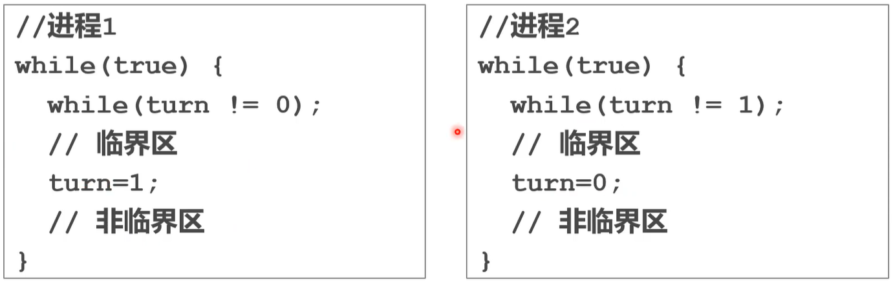

缺点：

​	当进程1 执行很快，而进程2在非临界区执行很慢时，进程2 会影响进程1 的执行 —— 进程1 要等待进程2 执行到 turn = 0。原因是，进程 1 主动交出了自己的控制权（将turn设置为1）

​	当进程1 与 进程2 属于不同的cpu时，进程没有并发执行，也没有利用cpu资源

*这里把进程换成线程也是适用的*


进程的每个轮次叫做 turn


==思考（改进）==：

* 每个线程进入临界区之前都标记自己对临界区资源感兴趣
* 进程执行完临界区后，不应该主动交出控制权（设置turn），而是观察其他进程对临界区的资源感不感兴趣。


### 3、Peterson算法

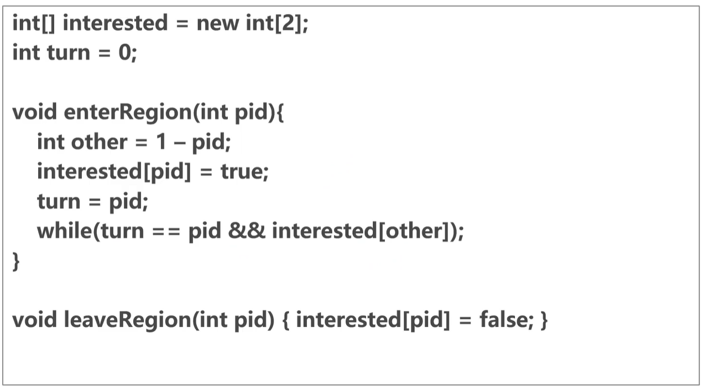	

算法解释：

* 假设进程1先进入临界区，进城2后进入。那么还是进程1先执行，进程2会被while挂起
* 进程1 执行完临界区代码，会执行 leaveRegion 释放
* 此时进程2 跳出while 循环，执行临界区，并释放，开始执行耗时长的非临界区代码
* 进程1 执行较快，又进入临界区，此时进程 1 可以顺利执行临界区代码


缺点：

*  通过算法保证，会有很多性能消耗


思考：学习算法思想保不齐可以在分布式的场景提供思路

算法故事：1981年诞生，通过纯软件来解决互斥问题。


### 4、TSL 硬件上锁

硬件

* TSL
* XCHG


硬件上锁是一种简单上锁。将密集的并发任务打散，让临界区永远只有一个任务。

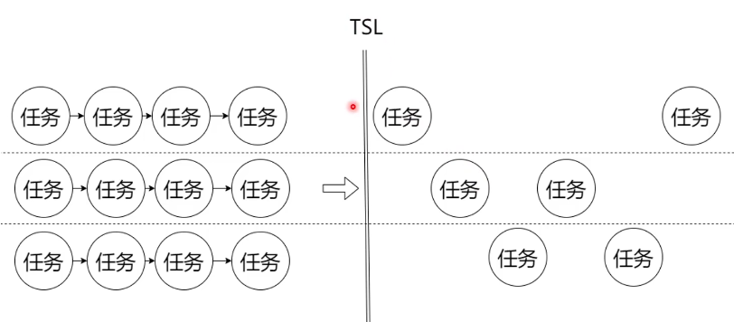	

缺点：

* 在某些场景下，希望能多个任务同时进入临界区
* 给出具体场景 TODO


==思考：==

* 如何控制同时进入临界区的线程数量？


### 5、信号量和互斥量

基于硬件的优化

> **信号量（Semaphore）**

==作用：==控制同时进入临界区的线程数量

一个控制同时访问一个资源的线程（进程）数量的抽象数据类型，是一种数据结构+算法（行为）。


数据结构

* p 可允许同时进入临界区的大小
* s  睡眠集合

提供两个原子操作

通过 TSL 锁括起来了，形成了两个原子操作

* down：任务进入临界区前，执行down操作；==如果p=0，则进入睡眠==，否则 p-- ，执行临界区代码
* up：任务退出临界区后，执行 up操作；从睡眠线程中唤醒一个并执行

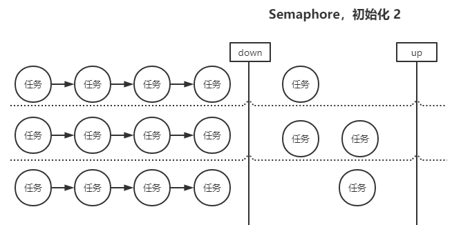	


==思考==：

* 解决一类有界缓冲区的问题，生产者/消费者


> 生产者/消费者

==如何控制 item 数量在 [0, N]之间？==，应用场景：消息队列，中间件


需要三个信号量（伪码）

* empty = new Semaphore(n)
* mutex= new Semaphore(1)
* full = new Semaphore(0)

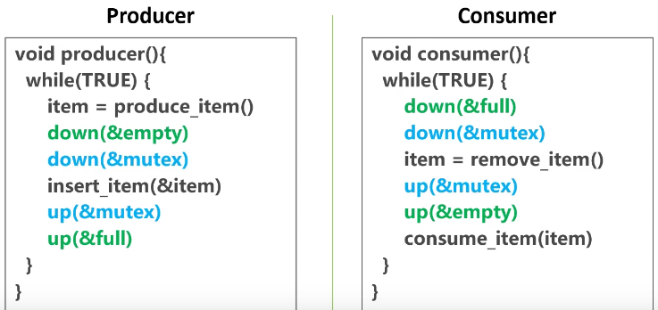	

代码解释

* 相同颜色是一对
* empty 和 full 控制进入的线程数，犹如一对括号一样，抽象数据结构带来了可读性
* metux 锁住临界区，生产者/消费者的临界区是一个队列，这个队列是内存中的数据结构，如果不保护会发生竞争条件，导致最后的执行结果取决于精准的执行时序。
* down和down、up和up之间可以有代码，如放一些耗时的操作来提高性能


> **互斥量（mutex）**

Semaphore 的衍生品，初始值为 1 的semaphore

可以用来锁住临界区


> 抽象数据结构

避免 if、switch case

让代码更健壮，更可读


> 多信号量造成死锁！

mutex  m1, m2

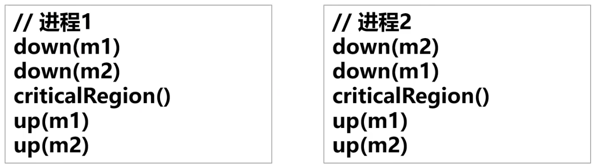	


==死锁==：进程1 与 进程2 互相等待


### 6、CAS

CAS：Compare and Swap（Java），跟 git 的使用原理是一样的。


**执行流程**（和 git 操作一致）

线程1和线程2需要对需要访问的临界区变量a，都保留了自己本地的一个 copy

线程2修改了a，并和临界区发生了==同步==

* 线程1读操作：线程1仍然认为a=100，这里发生了==不一致==（类似==幻读==）。但是因为业务场景关系，线程1认为这样==可以接收==

* 线程1写操作：线程1也想将 a+1 ，因此先将本地 a+1，然后将本地  101 和 临界区==比较==，因为发现了==冲突==。（谁发现谁解决）

* 线程1解决冲突：1）线程1 先将本地值和临界区同步；2）然后再 a+1；3）再和临界区比较


特点

* 读不需要同步
* 写需要同步
* 适用于写操作比较少，读操作比较多（==适用场景==）
* 注意：临界区的操作依然需锁


CAS 也称之为乐观锁


### 7、AQS

基于硬件会有一系列的抽象数据结构的解决方案，*算法数据结构是无穷无尽的*，会有更优秀的方案诞生

AQS：Abstract Queued Synchronization（Java）

用于实现多数场景的并发同步模型

* 可以实现 Semaphore/Mutex 等
* 可以用来实现更多的并发场景控制


### 8、Synchronized

这也是种数据结构（Java）


# 调度

调度 Skeduling

应用广泛

* Yarn 调度 Hadoop 集群
* Quartz调度任务
* Spring调度请求响应
* React Fiber 调度绘制任务
* Apache Flink 调度作业


调度本质

* 资源稀缺
* 根据不同场景找到最优解（类似 ==Programming - 规划==问题）


并发调度问题

多个进程和线程竞争CPU，2个或以上处于就绪状态，它们需要排队，需要操作系统提供调度的功能。

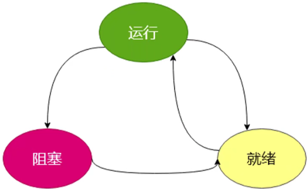	


## 调度关心的内容

> 被调度任务的特征

* 计算密集型
* IO密集型
* 分布式任务等等


> 执行时机

* 新任务何时执行
* 任务临时终止如何选择下一个任务
* 任务阻塞如何选择下一个任务
* 发生中断时（外部环境变化时），如何响应


> 调度算法

* 抢占式算法
* 非抢占式算法等等


例子

当 fork 出一个进程，此时有父子进程，谁先执行？？

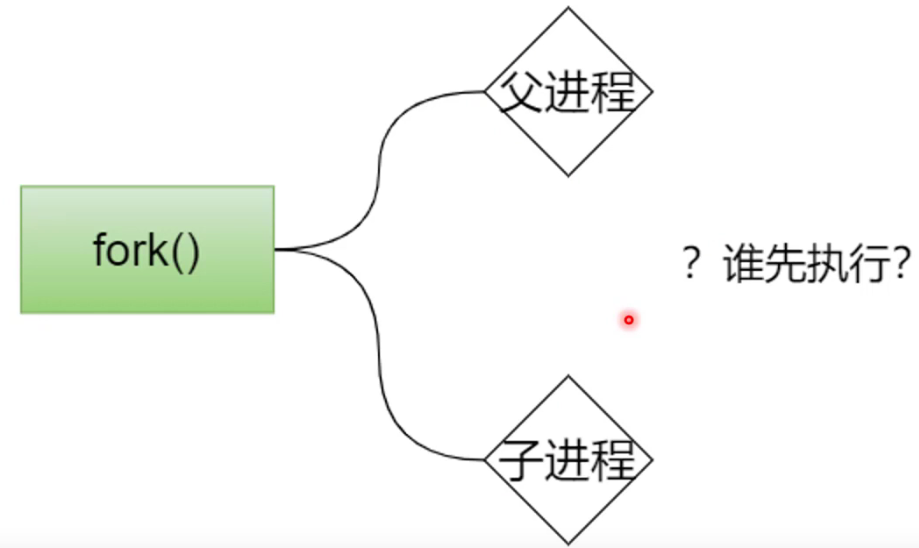	


> 调度的通用目标

* 公平 —— 每个进程公平的分享CPU 份额
* 策略强制执行——保证规定的策略被执行
* 平衡——保持系统尽可能忙碌，设置 CPU 、硬盘等的忙碌状态平衡


## 系统区别

> 批处理系统/作业系统

如中国移动的客服系统，==所有的作业不能中断==

关心：

* 吞吐量：一天能处理多少请求
* 周转时间：平均处理一个请求的时间
* CPU利用率：工作是否饱和，是否需要裁人加人

特点：

* 不可抢占


> 交互式系统

关心：

用户需要不断的交互，需要极高的响应和体验

特点

* 分时、可抢占


> 实时系统

车间、火箭发射，在指定时间必须完成

依赖很多算法，如动态规划

关心：

* 精准
* 稳定

特点：

* 完成时间确定


## 抢占式 vs. 非抢占式

抢占式：任务分时（时间片用完、更高优先级抢占等）

非抢占式：任务不分时（执行直到被阻塞）


## 调度算法

### Round Robin

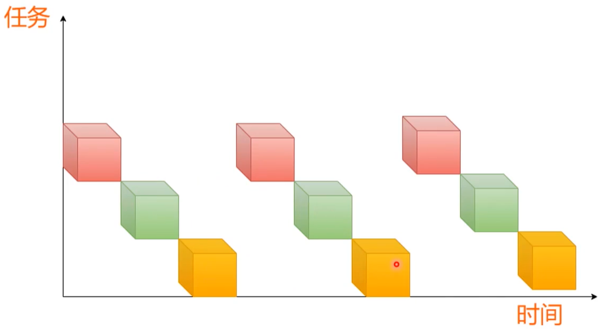	


伪码实现

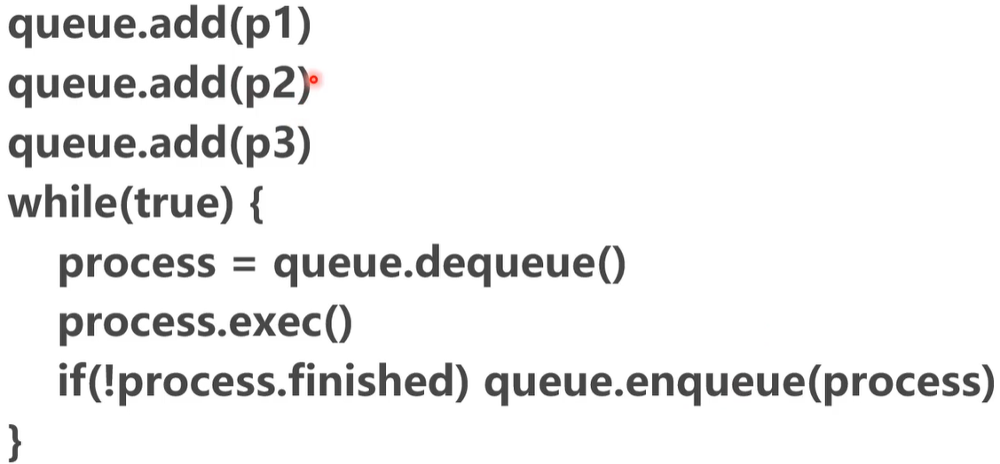	


### 优先级调度

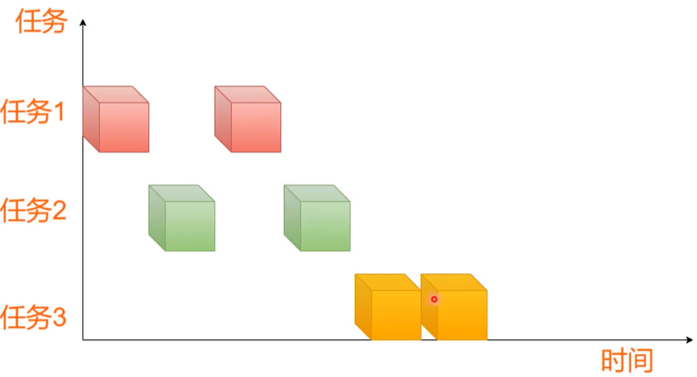	

红色和绿色先执行，黄色因为优先级低


伪码实现

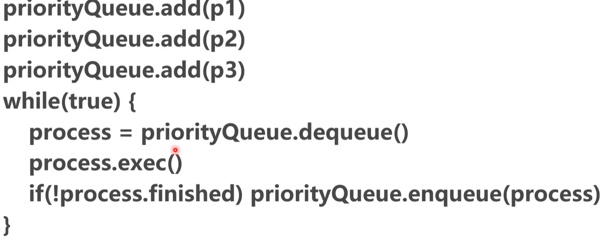	


==思考==：如果有相同优先级如何处理？

最短作业优先

* 按照平均执行时间短的优先执行，反映了用户的等待时间


==思考==：如何评估进程的运行时间？

如何历史处理的日志来分析判断进程的时间情况（*思想*）


### 实战：哲学家问题

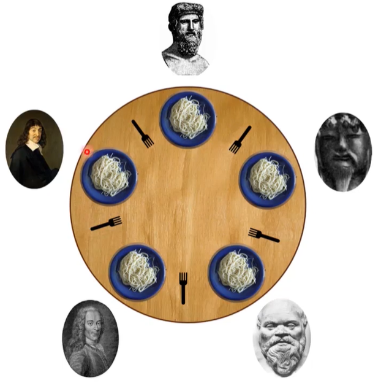	

描述

* 每个人只有同时拿起左右两幅叉子才能进餐
* 如何让每个人都能吃饱


解决

* 首先抽象化。为哲学家和叉子进行编号。

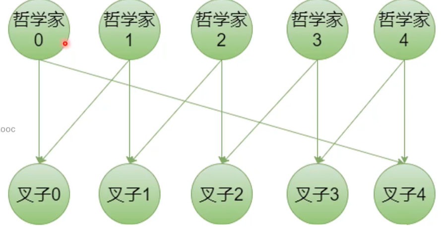

* 得出每个人的左右两边叉子的编号

    left(i) = (i - 1 + N) % N

    right(i) = (i + 1) % N

* 细化状态

    * 思考0 
    * 饥饿1 
    * 吃饭2 

* 伪码v1.0

```c
void philosopher(int i) {
    while(true) {
        think();
        take_fork(left);
        take_fork(left);
        eat();
       	put_fork(left);
        put_fork(left);
    }
}
```

代码问题：

* 没有管理临界区，极端情况下产生环形依赖，死锁。

代码改进探索：

* 如果发现拿不起叉子就放下叉子，也会产生另一个问题，所有人可能同时拿起左叉子，又同时放下。极端情况下会造成”雪崩“。


==思考==

* 哲学家最好同时拿起叉子，也同时放下叉子
* 一个哲学家拿叉子的过程，可以用 mutex 上锁，防止竞争条件
* 陷入饥饿的哲学家，让他们去睡觉；然后当一个进餐完的哲学家放下叉子，需要通知睡觉的哲学家 —— 这就是 Semaphore（信号量）

* 最大两个人可以同时吃饭

```c
void philosopher(int i) {
    while(true) {
        think();
        
        take_forks(i);
        
       	put_forks(i);
    }
}
```


检查自己是否可以进餐

```c
void test(i) {
    if(state[i] == HUNGRY && state[LEFT] != EATING && state[RIGHT] != EATING) {
        state[i] = EATING;
        up(i); // 唤醒i
    }
}
```


拿起叉子的过程

```c
void take_forks(int i) {
    down(mutex);
    state[i] = HUNGRY;
    test(i);
    up(mutex);
    down(i); // test 成功就会执行 up，拿不到就去睡觉
}
```


放下叉子的过程

```c
void put_forks(int i) {
    down(mutex);
    state[i] = THINKING;
    test(LEFT);
    test(RIGHT);
    up(mutex);
}
```


# 队列


## 优先级队列

数据结构：最大堆（Max Heap）


**特点**

* 二叉树
* 父节点比子节点大，子节点之间的顺序没有要求
* 树必须饱和


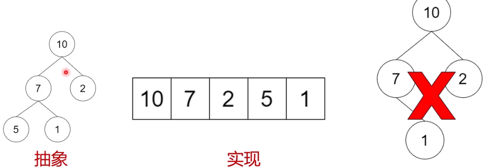	


**操作**

* 插入：新插入的值总是插入到末尾，然后根据最大堆的特性，进行交换直到满足特性
* 提取最大值：最大值总是在首个元素，提取后，将最后一个元素进行填充，然后根据最大堆的特性，进行交换直到满足特性


**复杂度分析**

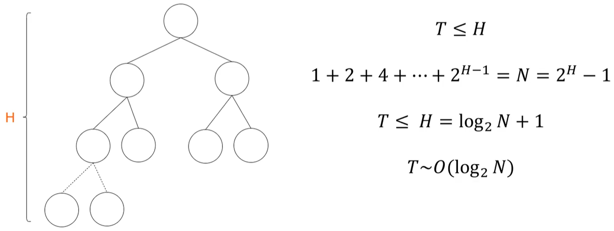	

所以，使用堆来实现，效率是非常高的


==应用场景==

TODO


# 内存

RAM：Random Access Memory

32位操作4个字节

64位操作8个字节


## 分层存储体系

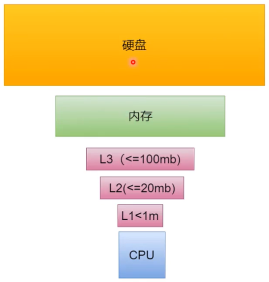	

CPU 里面是寄存器


**结论**

* 频繁切换进程会让缓存失效


==思考==：

* 如果操作系统允许应用直接接触内存？

    ​	应用会误操作，如破坏操作系统，恶意破坏其他应用


## 内存抽象模型

内存是稀缺资源


模型的建立：

* 基地址
* 界限寄存器 
* 交换技术 
* 虚拟化技术等


### 地址空间

地址空间是进程可以用来寻址的独立地址集合 —— 操作系统会为每个进程分配独立的地址包，超出部分会报错。

作用

* 保护操作系统
* 应用隔离


### 1、重定位

* 基地址寄存器：规定了进程可使用内存地址下限
* 界限寄存器：规定了进程可使用的地址上限

实际使用时，会用到地址重定位，如 jump 12 ，会**重定位**成 ==基地值+12== 得到完整的 内存地址。


当进程被中断调度时，进程保存操作系统寄存器的信息到自己的进程表中。

优点：

* 通过 offset 来规定进程表的查找，而不是通过 map 的方式

    前者仅通过序号定位，后者通过 hash 定位。前者效率更高。

缺点：

* 进程太多，内存不够分 ——  内存不够用
* 每次寻址都要做一次加法和一次校验 —— 内存是要频繁操作的，相当于一次操作就变成三条指令，性能不可接受。


### 2、**交换 swap**

特点

* 直接将内存以一整块的方式给到内存，并预留一定的空间，给进程持续增长
* 当内存不够时，将暂时不运行的进程内存，整个写到磁盘中

缺点：

* 每次为进程分配空间都要预留空间，为了进程的内存的增长，一旦超过阈值，需要整理内存
* 占用内存较大的进程写入磁盘，会非常慢


### 3、**虚拟化**

特点

* 将内存的数据结构拆分成更小的块
* 当内存不够用时，将不运行的进程内存，以部分块的形式写入磁盘
* 将离散的物理内存映射成连续的虚拟内存

优点

* 每个进程都认为自己独占资源，内存不需要整理
* 当内存不够用时，可以将进程内存拆分成若干块写入磁盘中。


实现

* 虚拟内存 64 kb，物理内存 32 kb
* 将一些不用的块映射到磁盘中，磁盘速度即使 ssd 也比内存慢 1000倍以上

* 页表（虚拟内存 page table）转换成页框（物理内存 page frame）


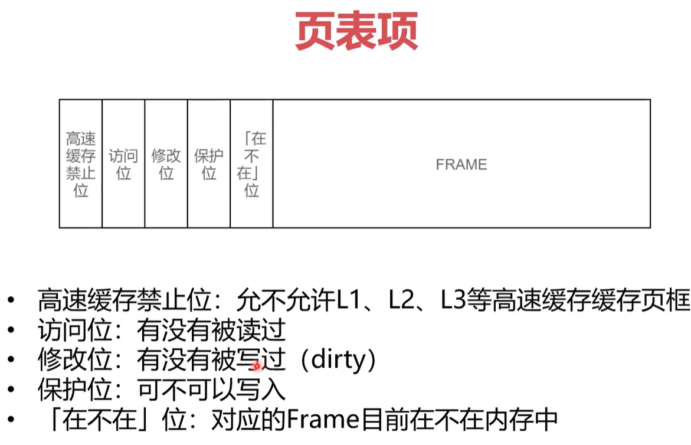	


 

==思考：==

* 频繁地做地址转换，岂不是又是性能损耗吗


### MMU

MMU 位于CPU 内部，可以通过**硬件电路**完成内存映射，非常快，不到一个CPU周期（Cycle）时间

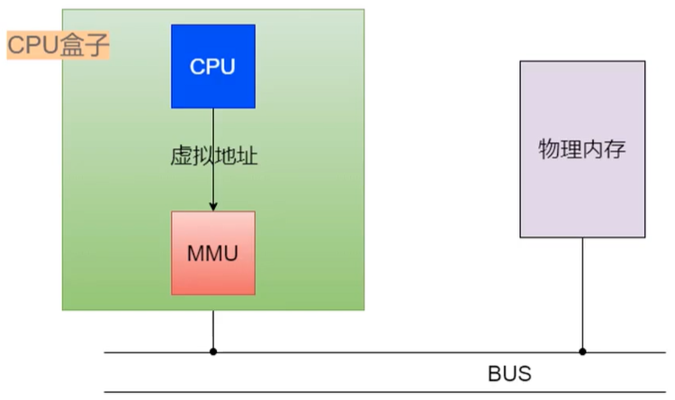	


### 缺页中断


### 多级页表


### 快表

也叫转换检测缓冲区，可以加速 MMU 的读写

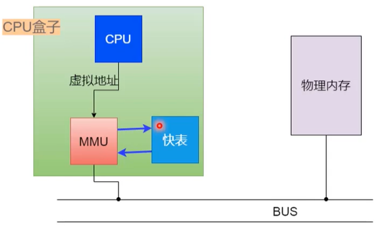	


快表内部，将常用的地址映射存起来

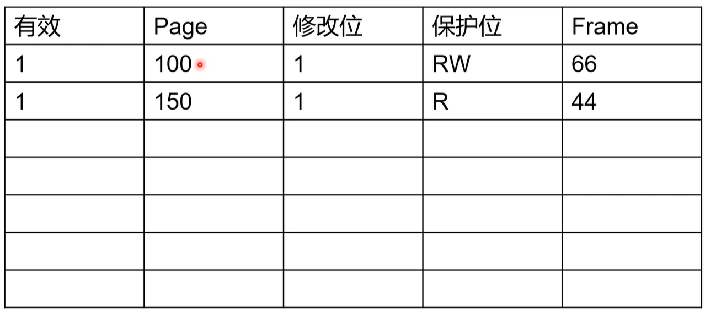	


==思考==

* 快表的命中率如何？

    命中率非常高，因为一个page 是一段内存，进程对内存的优化，要把经常处理的东西集中起来，让一个对象相近的程序也在周围。


## 程序内存管理

进程拿到内存后，会内存有自己的管理（进一步抽象）

特点

* 将内存分成一个个分隔的片段（Segment）

* 段与段之间有一定的空闲内存，方便继续分配内存

    ​	以stack为例，认为stack可以无限增长，永远不会碰到 heap

    

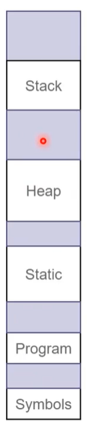	

结构

* stack：
* heap：存不规则的对象
* static：存常量
* program：存程序代码
* symbols：反射类的语言程序会有符号


## 垃圾回收

客观存在 和 消耗性能


### 引用计数回收

算法

* 普通引用计数法
* 基于图的引用计数方法


### 跟踪垃圾回收

主流算法

算法

* mark-sweep算法

* 三色标记法


# Socket

对应的硬件是网卡，软件层面的抽象是 Socket，当Socket收到数据后...


# 函数库


# 中断程序

中断是系统用来响应硬件设备请求的一种机制，操作系统收到硬件的中断请求，会打断正在执行的进程，然后调用内核中的中断处理程序来响应请求


